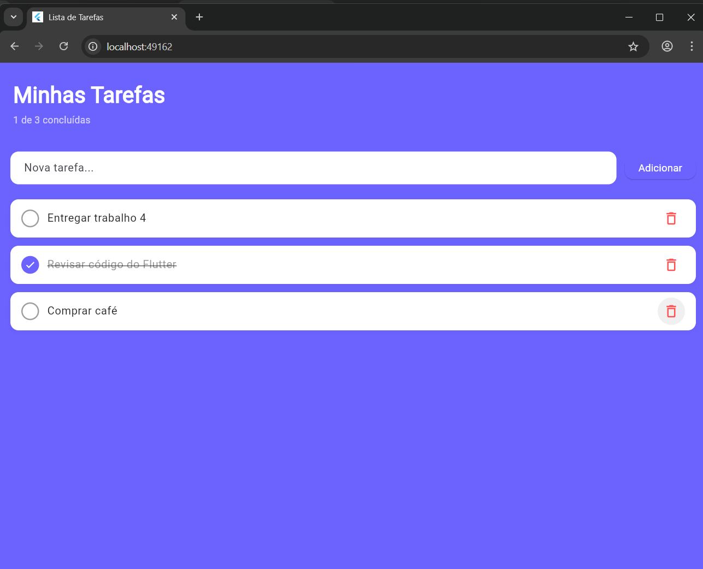

# Lista de Tarefas - Flutter + Riverpod

**Estudante:** Bruno Coelho Hasse

---

## Descrição da Aplicação

Aplicativo de lista de tarefas (To-Do List) desenvolvido em Flutter, executado no navegador via Flutter Web. Permite ao usuário adicionar, visualizar, marcar como concluídas e remover tarefas, com interface limpa e feedback visual em tempo real.

---

## Gestão de Estado com Riverpod

A gestão de estado foi implementada utilizando a biblioteca **Riverpod 3.x**, seguindo a abordagem moderna com `Notifier` e `NotifierProvider`.

### Como funciona:

- A classe `TarefasNotifier` estende `Notifier<List<Tarefa>>` e centraliza toda a lógica de manipulação da lista de tarefas (adicionar, alternar conclusão e remover).
- O `NotifierProvider` expõe o estado globalmente para todos os widgets que precisam acessá-lo.
- Os widgets utilizam `ref.watch(tarefasProvider)` para reagir automaticamente a qualquer mudança no estado, e `ref.read(tarefasProvider.notifier)` para disparar ações.
- Isso garante separação completa entre interface e lógica, sem necessidade de `setState`.

---

## Estrutura de Arquivos

```
lib/
├── main.dart              # Ponto de entrada, configuração do app e página principal
├── tarefas_provider.dart  # Modelo Tarefa, TarefasNotifier e NotifierProvider
└── widgets.dart           # Widgets reutilizáveis: CampoNovaTarefa, ItemTarefa, ListaTarefas
```

### Componentes

**`tarefas_provider.dart`**
Contém o modelo `Tarefa` (id, titulo, concluida), o `TarefasNotifier` com os métodos de CRUD e o provider global `tarefasProvider`.

**`widgets.dart`**
- `CampoNovaTarefa` — campo de texto e botão para adicionar tarefas
- `ItemTarefa` — card individual com botão de conclusão e remoção
- `ListaTarefas` — lista com `ListView.builder` ou tela vazia quando não há tarefas

**`main.dart`**
Inicializa o `ProviderScope` (obrigatório para o Riverpod funcionar), configura o tema e monta a página principal com contador de tarefas concluídas.

---

## Como Executar

### Pré-requisitos

- [Flutter SDK](https://flutter.dev/docs/get-started/install) instalado
- Google Chrome instalado

### Passos

1. Clone o repositório:
   ```bash
   git clone https://github.com/BrunoCoelhoH/trabalho4-mobile-flutter.git
   ```

2. Acesse a pasta do projeto:
   ```bash
   cd trabalho4-mobile-flutter
   ```

3. Instale as dependências:
   ```bash
   flutter pub get
   ```

4. Execute no navegador:
   ```bash
   flutter run -d chrome
   ```

---

## Interface


